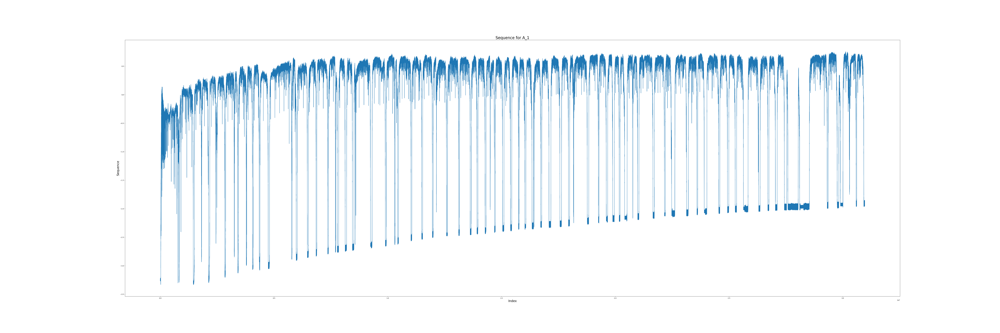
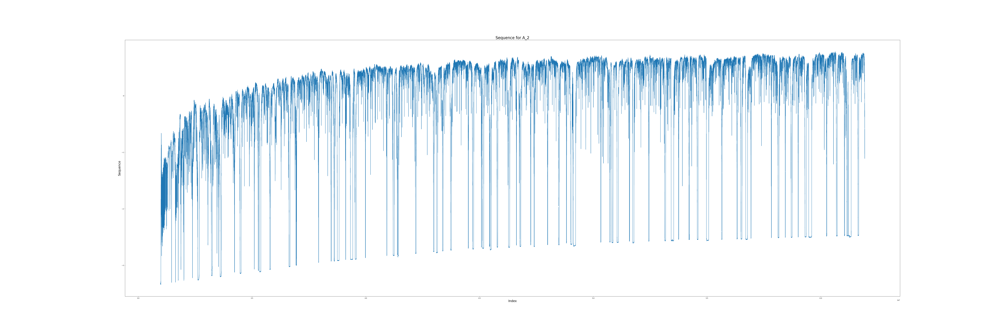

# Valvometry

## Description
This project is centered on the classification of oyster genders (Male/Female) during their early life stages using time series data. We leverage valvometry, a method that employs electromagnetic sensors to measure the micro closures of oysters, reflecting their opening and closing activity. The data, recorded every 0.1 ms over a 6-day period, comes in the form of extensive and intricate CSV files. It's important to highlight that this dataset contains anomalies and variations, with different sensor parameters used for each sample.

To analyze this data, we employ AI models, particularly focusing on RNNs with LSTM layers and CNNs. The models have been developed using Python and the PyTorch framework.


## Visualization
Sample plots can be found in the `./plots` directory.

Example Plot 1 (Female Oyster - A1):


Example Plot 2 (Male Oyster - A2):


## Setup and Usage

### Installation
To install the necessary dependencies:
```bash
pip install -r requirements.txt
```

### Training
1. Choose the desired model for training in the `submit_venv.sh` file.
2. Launch the training process using the following command:
```bash
sbatch submit_venv.sh
```

### Results
Training results and logs can be accessed in the `./logs` directory.
Google Drive link: [new_google_drive_link](https://drive.google.com/drive/folders/1NHZq86wb4mbXwzRjb4mfaKLgCAriHsRj?usp=drive_link)
