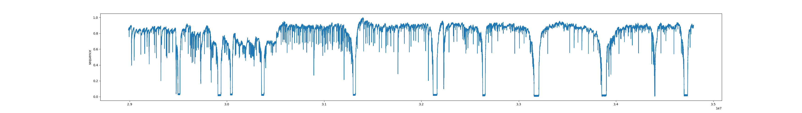
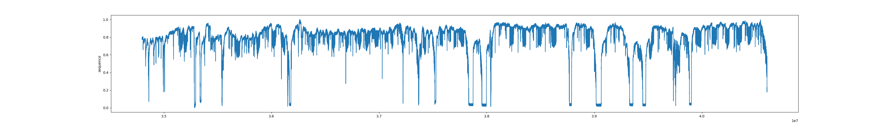

# Valvometry

## Description
The Valvometry project is dedicated to the classification of oyster genders (Male/Female) during their early life stages. This is achieved using intricate time series data from valvometry, a technique that employs electromagnetic sensors to record the number of microclosures exhibited by each oyster.

The project predominantly uses AI models, with a focus on RNN models that incorporate LSTM layers. CNN models have also been explored, producing superior results in some instances. The models have been developed using Python and the PyTorch framework.

Data for this project consists of large and intricate CSV files that span over a period of 6 days, recording oyster openings every 0.1 ms. It's worth noting that the data has its fair share of anomalies and variations, especially considering that different sensor parameters are utilized for each sample.

## Visualization
Sample plots can be found in the `./plots` directory.

Example Plot 1 (Female Oyster - C2):


Example Plot 2 (Male Oyster - C3):


## Setup and Usage

### Installation
To install the necessary dependencies:
```bash
pip install -r requirements.txt
```

### Training
1. Choose the desired model for training in the `submit_venv.sh` file.
2. Launch the training process using the following command:
```bash
sbatch submit_venv.sh
```

### Results
Training results and logs can be accessed in the `./logs` directory.
